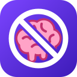
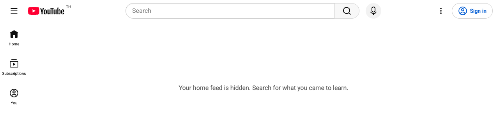
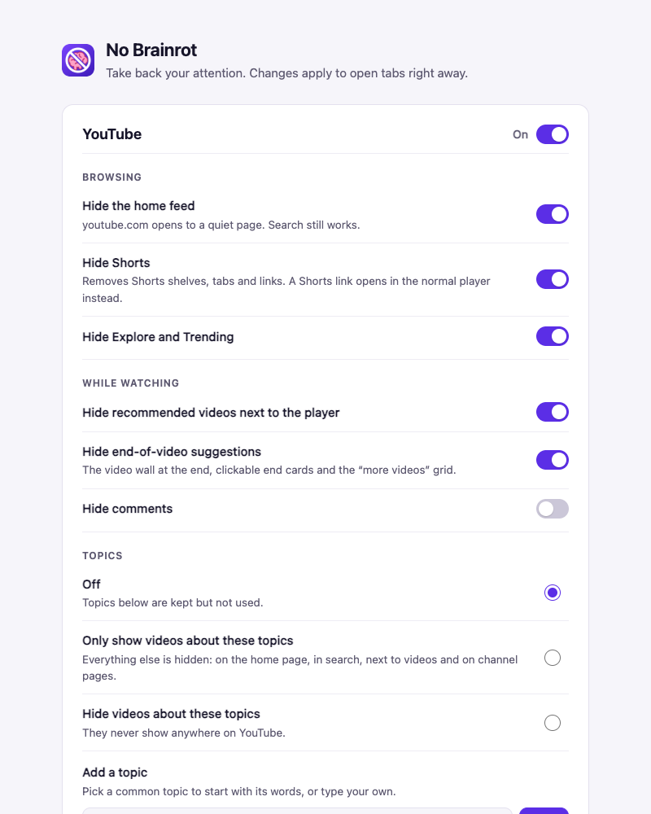

  

<h1 align="center">No Brainrot</h1>

<strong>Take back your attention on YouTube and Instagram.</strong>

  
  
  

No Brainrot is a free browser extension that removes the parts of YouTube and
Instagram built to keep you scrolling: Shorts, Reels, recommendations and the
endless home feed. Pick the channels and topics you care about and filter out
the rest, so you get the video you came for, not the next hour of scrolling.

- **Stop the scroll.** Shorts, Reels, the home feed and "up next" suggestions
  disappear.
- **See only what you pick.** Block channels and words, or allow only the
  channels you learn from.
- **Instant.** Every setting is a switch, and open tabs update right away.
- **Private.** No account and no tracking. Nothing leaves your browser.
- **Free and open source.** MIT licensed.

## What it does

**YouTube**

- Hides the home feed, Shorts, Explore and Trending, the recommendations next to
  the video, and end-of-video suggestions. Comments can be hidden too.
- Opens any Shorts link in the regular player.
- Filters videos on the home page, in search, next to videos and on channel
  pages:
  - **Blocked channels** never show.
  - **Blocked words** hide videos whose title contains them, as whole words, in
    any capitalization.
  - **Allowed channels** are never hidden by blocked words. Turn on *Only show
    videos from allowed channels* and nothing else shows at all.
  - **Topics** such as AI, Gaming or Sports: either show *only* videos about
    the topics you pick, or hide videos about them. A topic is a list of words
    looked for in video titles. Common topics come with a starter list you can
    edit, and you can make your own.

**Instagram** (unfinished)

- Opens the Following feed (people you follow, newest first) instead of the
  suggested feed.
- Hides Reels, the grid of recommended posts under Search, place pages and
  suggested accounts. Search, messages and reels someone sends you still work.
- **Not done yet:** hashtag pages still show a grid of posts from anyone, and
  only the desktop layout in English has been checked. What is left is tracked
  in [#2](https://github.com/lpedenon/no-brainrot/issues/2).

## Install

No Brainrot is not in the Chrome Web Store or Firefox Add-ons yet. Install it
from a release.

### Chrome, Edge, Brave, Arc and other Chromium browsers

1. Download the file ending in `-chrome.zip` from the
   [latest release](https://github.com/lpedenon/no-brainrot/releases/latest)
   and unzip it.
2. Open `chrome://extensions` (in Edge, `edge://extensions`).
3. Turn on **Developer mode**.
4. Click **Load unpacked** and pick the unzipped folder.

Keep that folder, because the browser loads the extension from it. To update,
replace the folder's contents with a newer release and click the reload icon on
the extension's card.

### Firefox

Firefox only installs add-ons permanently once Mozilla has signed them, which
happens when they are published on Firefox Add-ons. Until then you can try it
for one session:

1. Download the file ending in `-firefox.zip` from the
   [latest release](https://github.com/lpedenon/no-brainrot/releases/latest).
2. Open `about:debugging#/runtime/this-firefox`, click **Load Temporary
   Add-on…** and pick the zip.

It stays installed until you restart Firefox.

## Use it

Click the No Brainrot icon in the toolbar to open its settings. Everything is on
by default except hiding comments.

For a learning-only YouTube, add the channels you learn from under **Allowed
channels** and turn on **Only show videos from allowed channels**.

To watch only one kind of video, say AI, add the **AI** topic under **Topics**
and choose **Only show videos about these topics**. To keep a topic away
instead, such as gaming, add it and choose **Hide videos about these topics**.
Topics go by the words in video titles, so add any word your topic's videos use
that the list is missing. Channels you allow always show, whatever their titles
say.

## Good to know

- It works in desktop browsers. The YouTube and Instagram phone apps are not
  affected.
- YouTube and Instagram change their pages from time to time, which can let
  something slip through. If it does, please
  [open an issue](https://github.com/lpedenon/no-brainrot/issues/new/choose).
- Instagram support is unfinished (see above). You can switch it off in the
  settings and keep only YouTube.

## Privacy

No Brainrot collects nothing and makes no network requests. Your settings stay
in your browser. See [PRIVACY.md](PRIVACY.md).

## Contributing

Bug reports, ideas and pull requests are welcome. [CONTRIBUTING.md](CONTRIBUTING.md)
explains how to build it, run the tests and fix a page after a site changes.

To build from source: `pnpm install && pnpm build`, then load
`.output/chrome-mv3` as described above.

## License

[MIT](LICENSE) © lpedenon
